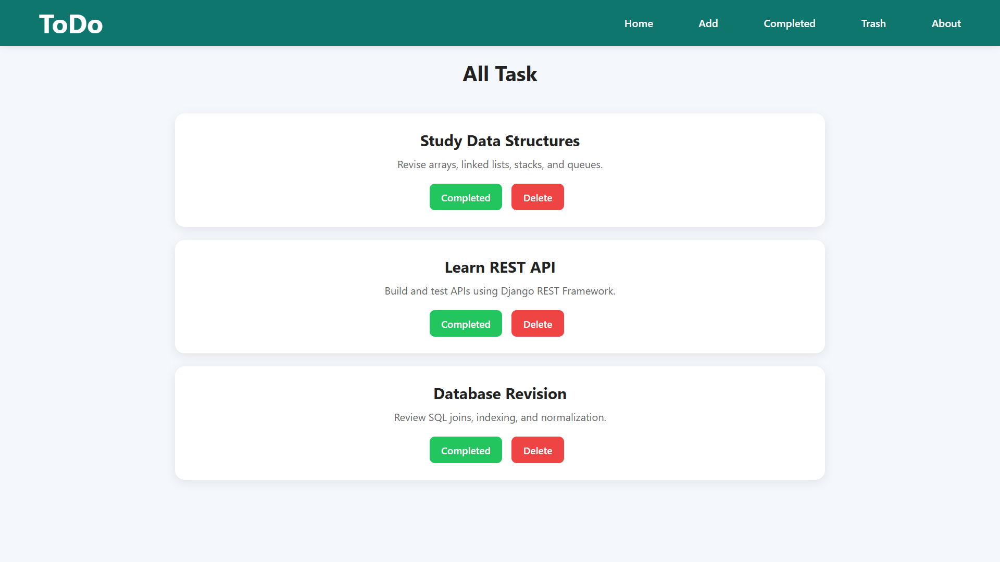
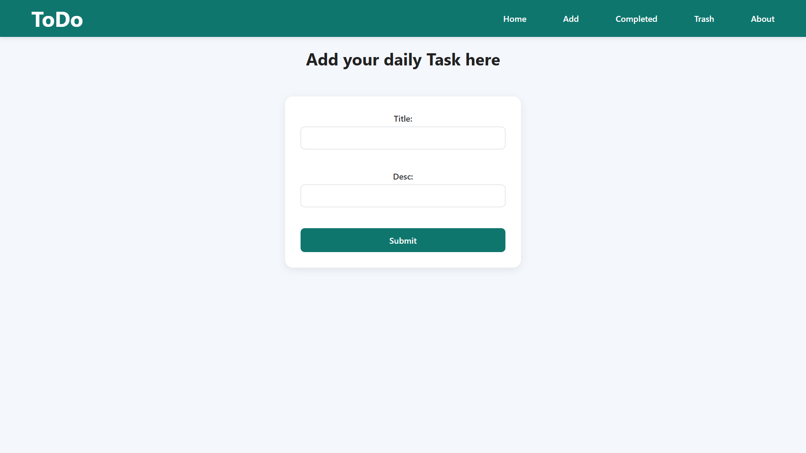
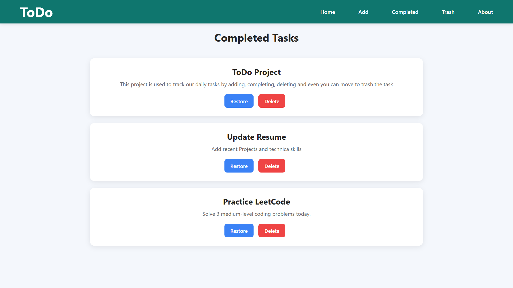
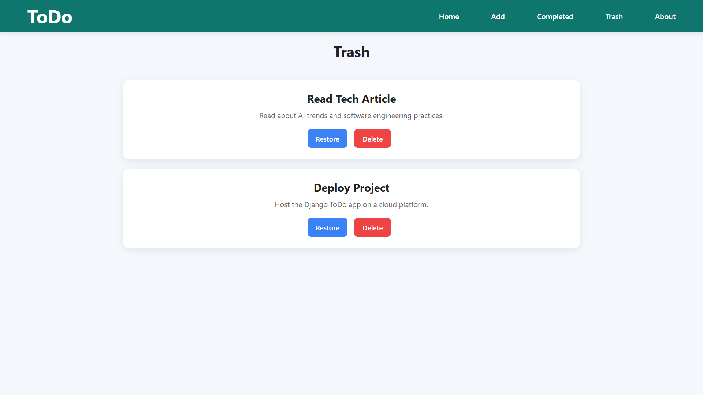

# 📝 Django ToDo App

A simple and responsive ToDo List Web Application built using Django. This application helps users manage daily tasks efficiently with features for adding, completing, restoring, and deleting tasks.

## 🚀 Features

* Add new tasks
* View all tasks
* Mark tasks as completed
* Restore completed tasks
* Move tasks to trash
* Restore tasks from trash
* Permanently delete tasks
* Clean and responsive user interface

## 🛠️ Tech Stack

* Python
* Django
* HTML5
* CSS3
* SQLite

## 📂 Project Structure

```text
todo_project/
│
├── app/
├── templates/
├── static/
├── db.sqlite3
├── manage.py
└── requirements.txt
```

## ⚙️ Installation

### Clone the repository

```bash
git clone https://github.com/your-username/django-todo-app.git
```

### Move into the project directory

```bash
cd django-todo-app
```

### Install dependencies

```bash
pip install -r requirements.txt
```

### Run migrations

```bash
python manage.py migrate
```

### Start the development server

```bash
python manage.py runserver
```

### Open in browser

```text
http://127.0.0.1:8000/
```

## 📸 Screenshots

Add screenshots of your application here.

### Home Page



### Add Task Page



### Completed Tasks



### Trash



## 📚 Learning Outcomes

* Django CRUD Operations
* URL Routing
* Template Inheritance
* Static Files Management
* Database Integration
* Frontend Styling with CSS

## 🔮 Future Enhancements

* User Authentication
* Task Categories
* Search Functionality
* Dark Mode
* Due Dates and Reminders

## 👩‍💻 Author

**Priya**

If you found this project useful, feel free to ⭐ the repository.
